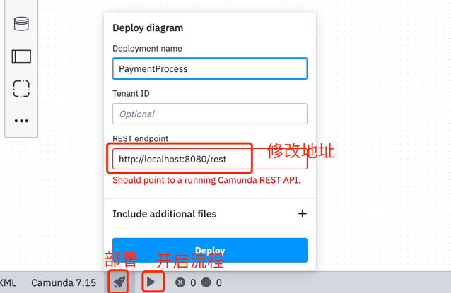

# camunda-demo

# sql脚本

# 流程

1、绘制bpmn,导出xml,放入resources/bpmn

2、流程部署，将定义的流程模型部署到流程引擎中；

    部署方式：
        1、直接将bpmn文件放入resources/bpmn目录下，启动项目，流程引擎会自动部署；
    
        2、手动部署，使用Camunda Modeler进行部署；

3、启动流程实例，启动流程实例，流程实例启动后，流程引擎会根据流程定义的信息创建相应的流程实例；

