# camunda-demo

# sql脚本

/Users/wangxuan/project/camunda-demo/db

# 流程

1、绘制bpmn,导出xml,放入resources/bpmn

2、流程部署，将定义的流程模型部署到流程引擎中；

## 部署

部署方式：

1、直接将bpmn文件放入resources/bpmn目录下，启动项目，流程引擎会自动部署；

新建META-INF目录，新建processes.xml文件，内容如下：

```xml
<?xml version="1.0" encoding="UTF-8" ?>
<process-application
        xmlns="http://www.camunda.org/schema/1.0/ProcessApplication"
        xmlns:xsi="http://www.w3.org/2001/XMLSchema-instance">

    <process-archive>
        <process-engine>default</process-engine>
        <!-- 默认会扫描resource（及其子目录下）的*.bpmn, *.cmmn, *.dmn文件 -->
        <!-- 可通过<resource/>指定其他的需要一同部署的资源文件-->
        <!-- 注：formKey中路径需和resource路径一致，如：camunda-forms:deployment:bpmn/payment_confirm.form -->
        <!-- 注：通过Modeler作为附件一起部署，formKey格式为：camunda-forms:deployment:payment_confirm.form -->
<!--        <resource>bpmn/PaymentInitForm.form</resource>-->
<!--        <resource>bpmn/PaymentConfirmForm.form</resource>-->
        <properties>
            <property name="isDeleteUponUndeploy">false</property>
            <property name="isScanForProcessDefinitions">true</property>
        </properties>
    </process-archive>

</process-application>
```

    

2、手动部署，使用Camunda Modeler进行部署；
            
发布地址：即项目集成camunda部署的地址，http://localhost:19091/engine-rest

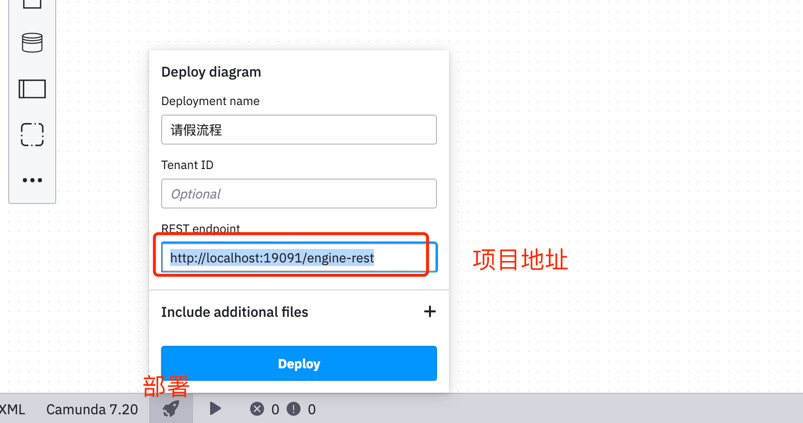

部署完之后，即可看到流程定义
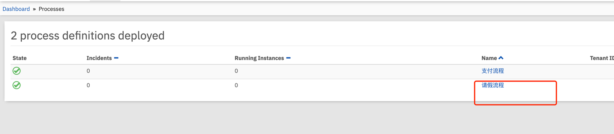

3、启动流程实例，启动流程实例，流程实例启动后，流程引擎会根据流程定义的信息创建相应的流程实例；


# 名词

processKey: 流程定义的key,即bpmn文件中的id

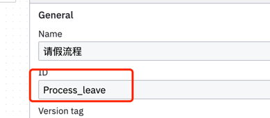

processInstanceId: 流程实例id

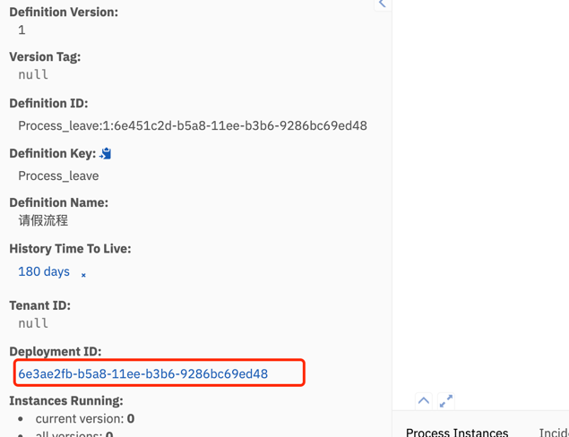


# api

## 1、启动流程实例

/start/{processKey}

可以将流程过程中的变量传入


# 任务

## 用户任务userTask

## 业务任务ServiceTask

### JavaClass

不需要注入IOC容器，直接实现JavaDelegate接口，重写execute方法即可；流程图中的serviceTask的class属性，配置类的全限定类名

```java

public class ReserveRepairService implements JavaDelegate {
    @Override
    public void execute(DelegateExecution delegateExecution) throws Exception {
        String currentActivityName = delegateExecution.getCurrentActivityName();
        System.out.println("当前服务节点：【" + currentActivityName + "】");
        String processDefinitionId = delegateExecution.getProcessDefinitionId();
        System.out.println("currentActivityName: " + currentActivityName + ", processDefinitionId: " + processDefinitionId);
    }
}
```

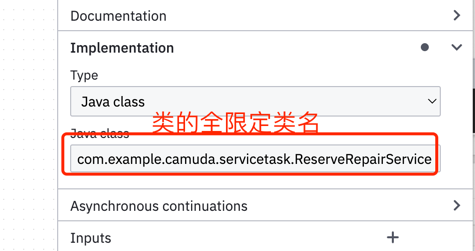

### DelegateExpression

委派Java类，即实现JavaDelegate接口的类，定义Bean名字，流程中配置BeanName


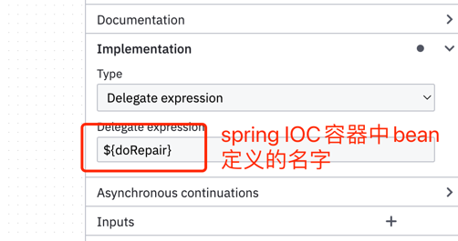

```java
/**

@Service("doRepair")

定义bean的名字，用于流程图中的serviceTask的delegateExpression属性

*/

  @Service("doRepair")
  public class DoRepairService implements JavaDelegate{}
  
```

### Expression

使用EL表达式接收bean.callMethod()的方式执行，相对于DelegateExpression，Expression更加灵活，无须实现JavaDelegate接口，可以是任意方法、参数；

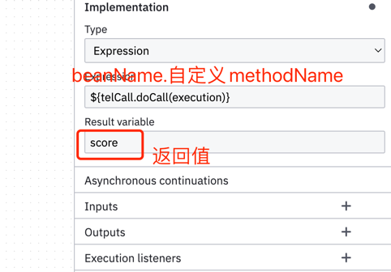

```java
/**
 * 定义bean的名字,${telCall.doCall(execution)}
 */
@Service("telCall")
public class TelCallService {

    private Long doCall(DelegateExecution execution) {
        System.out.println("~~~TelCallService.doCall");
        String repairManName = String.valueOf(execution.getVariable("repairManName"));
        System.out.println("服务打几分？");
        return 10L;
    }
}
```

## 外部任务ExternalTask

1、Process Engine

2、External Worker

3、External Worker & process engine

rest api，长轮询机制；

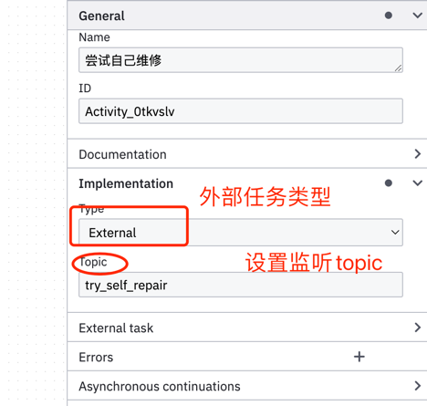

引入依赖

```java

        <dependency>
            <groupId>org.camunda.bpm.springboot</groupId>
            <artifactId>camunda-bpm-spring-boot-starter-external-task-client</artifactId>
            <version>7.15.0</version>
        </dependency>

        <dependency>
            <groupId>javax.xml.bind</groupId>
            <artifactId>jaxb-api</artifactId>
            <version>2.3.0</version>
        </dependency>
```


## 外部任务监听器


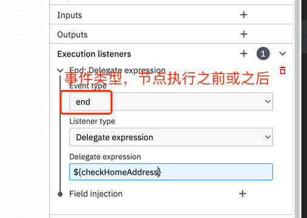


## 授权过滤器

外部任务，需要配置用户信息，才能访问流程引擎控制中心数据,保证数据安全；

否则：HTTP/1.1' returned error: status code '401' - message: status code: 401

新增配置项

```java
camunda.bpm.client.basic-auth.username=wangxuan
camunda.bpm.client.basic-auth.password=wangxuan

```

## 多实例任务并行&串行

### 串行

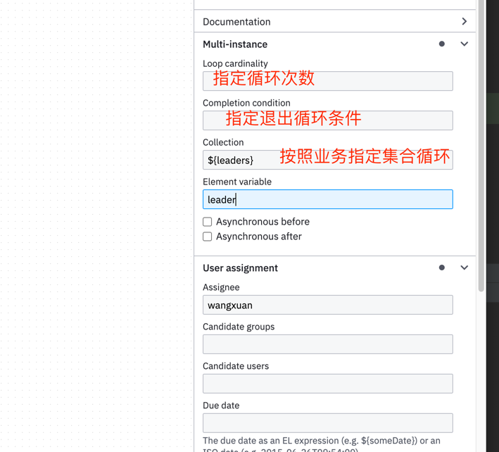


### 并行

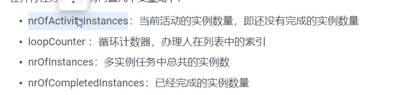


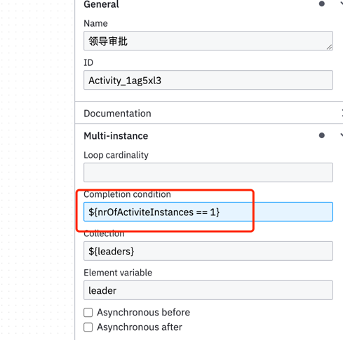

任务列表会存在同时存在多人任务

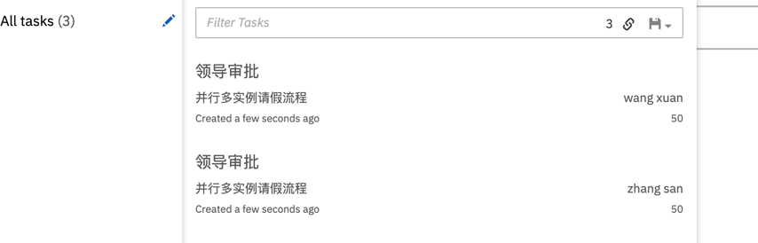


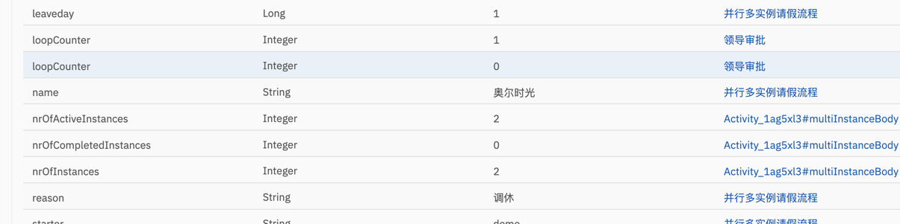


## 脚本任务

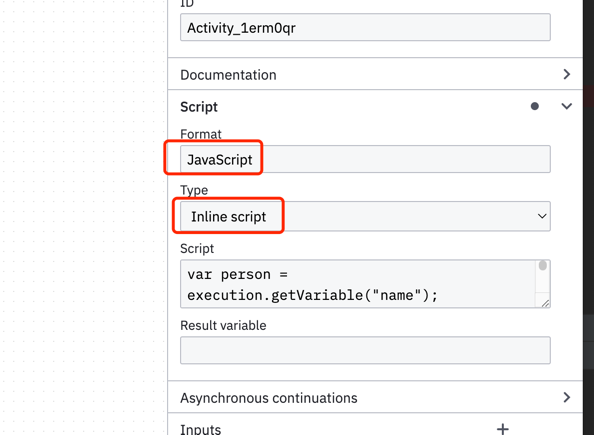
